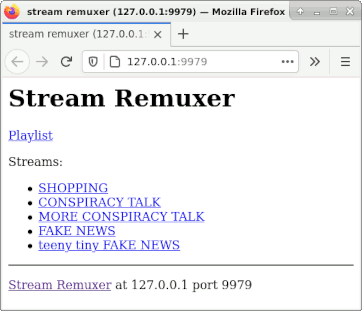

# Stream Remuxer for TVHeadend

A lightweight streaming media proxy which makes configuring [TVHeadend](https://github.com/tvheadend/tvheadend) to serve Internet radio/TV channels easier.

Takes a flat-file list of streaming media channels; serves up MPEG-TS format streams suitable for consumption by TVHeadend, along with an M3U playlist so you can configure your channel list in TVHeadend as an "IPTV Automatic" network.

Works on Linux.  Probably works on MacOS and other Unixes.  Probably won't work on Windows.

### Why?

Nowadays many radio and TV channels stream online.  Those of us who run TVHeadend would love to be able to watch/listen to these channels just by dialing a channel number, as with traditional terrestrial/satellite channels.  Unfortunately, TVHeadend only understands plain-HTTP (not HLS) streams in MPEG2 Transport Stream format, which very few content providers support natively.  What to do?

- You could set up [node-ffmpeg-ts-proxy](https://github.com/Jalle19/node-ffmpeg-mpegts-proxy) to convert the streams, but this uses avconv which isn't available as a package in stock Debian, and it would require me to install NodeJS just to run it.  Sorry, I'd rather install something with a smaller footprint.
- It's possible to set up [custom commands per-channel](https://tvheadend.org/projects/tvheadend/wiki/Custom_MPEG-TS_Input) to stream in content from elsewhere and convert it to an MPEG TS, but configuring this for more than a couple of channels is a massive PITA.
- You know, I did write a [tiny streaming media server in Bash](https://github.com/pobrelkey/alarum) once upon a time... hey, why not use something lightweight like that?  It only has to pipe output from VLC down a TCP connection...

So I wrote this tool, with the following objectives:

- delegates to [VLC](http://www.videolan.org/) - known to understand a wide range of streaming formats
- a shell script - small, comprehensible, tweakable
- simple, widely-recognized config format
- can optionally transcode streams served up using mutant codecs

### Installation

- Install VLC: `apt-get install vlc`
- Copy `stream-remuxer.sh` to a directory on your local system (for example, `/opt/stream-remuxer`)
- Create a `channels.m3u` file in the same directory as the script edited to your preferences - see section below on config file format, though an ordinary M3U channel list should suffice
- Configure `stream-remuxer.sh` to be run as an `inetd`-style TCP server.  There are various ways to do this:
  - Assuming your system runs `systemd` (most Linuxes do these days), you can configure this to happen by copying the [`stream-remuxer.socket`](systemd/stream-remuxer.socket) and [`stream-remuxer@.service`](systemd/stream-remuxer@.service) files in this repository to your `/etc/systemd/system` directory, then typing `sudo systemctl enable stream-remuxer.socket ; sudo systemctl start stream-remuxer.socket`.  (See [this article](http://0pointer.de/blog/projects/inetd.html) for more info on how this works.)
  - Or, you could install a "proper" `inetd` (like `xinetd`) on your system and configure it to run this script whenever it receives a connection on port 9979.  Please see the documentation for your chosen `inetd` for instructions on how to do this.  Ensure the script is run as `nobody` or a similarly unprivileged user, as if VLC is run as root it will complain and quit.
  - Or, for development purposes, you could simply invoke `stream-remuxer.sh` from a terminal with no arguments - this starts up a server on port 9979, provided you have `busybox` installed, and it has the `nc` applet built in (which is how it's built on any mainstream Linux distro).
- On the machine where you've installed stream-remuxer, browse to http://127.0.0.1:9979/ - assuming everything's working you should see a simple HTML menu:
  
- Now set up an "IPTV Automatic" network in TVHeadend, with the playlist URL as http://127.0.0.1:9979/playlist.m3u - see the [TVHeadend docs](https://tvheadend.org/projects/tvheadend/wiki/Automatic_IPTV_Network) for more details.  You should be able to "scan" this network and have TVHeadend find all the channels in your list.

The above instructions assume you're installing stream-reumxer on the same box as TVHeadend - if you aren't:
- ensure systemd/inetd is configured to listen on an IP address your TVHeadend box can reach, i.e. not 127.0.0.1
- ensure the script knows what its local address and port are, as these will appear in the output - use the `-a` and `-p` command line options to specify these
- change URLs as appropriate in the above instructions to point to the stream-remuxer box and not 127.0.0.1

### Configuration

The script accepts a few command line flags - all of them optional:

- `-a (address)` and `-p (port)` - tells the script it receives connections on an address/port other than 127.0.0.1 and port 9979 (the defaults).  Affects the output of this script - particularly the playlist, which has to include full HTTP addresses.
- `-c (file)` - gives the path to the channels list.  Default is to use `channels.m3u` in the same directory as the script. 

The channels list specifies the channels the server will make avaialble.  An ordinary M3U channel list should be fine, though do note the following:

- "Channel ID" (which forms part of the channel's URL on the server) comes from the following sources, in priority order - please make sure this is unique per-channel:
  - the `sr-id` tag in the EXTINF
  - the `tvg-id` tag in the EXTINF
  - the channel name, after the last comma in the EXTINF
  - the channel URL
- You can add VLC transcode arguments for a channel by adding an `sr-transcode-opts` tag in the EXTINF.
- Blank lines are acceptable; lines beginning with a hash (but not `#EXTINF`) are ignored as comments.

Given that there's a real possibility their servers will get hammered by lots of random people testing/tweaking their configuration of this script :trollface:, the stations in the example `channels.m3u` file are ones I don't approve of.  There's no guarantee these stations will still be accessible at the given addresses by the time you read this, so if you try watching one of these streams and nothing happens, don't blame me.  Once you're sure your setup works, replace this file with a list of channels you actually want to watch.

### Caveats

- This is a web service written in _bash_.  By its nature, it's probably not very secure.  Don't make it accessible to untrusted hosts.

- The M3U channel list parsing is rudimentary, and might trip over misplaced commas/double quotes.  Also, transcode arguments in your M3Us will get fed straight to VLC, and who knows what vulns lurk in that code.  So only use this with well-formatted channel lists you've hand-assembled yourself, and not huge M3Us full of random junk downloaded from the Internet.

- Error handling is rudimentary as well - the stream just cuts off if VLC dies/fails to start.

- I wish there were a nicer way of handling client disconnections than `kill -9`-ing VLC, but if I didn't do this VLC will just sit there forever reading the incoming stream and trying to write it to a broken pipe.

- Anything VLC writes to stdout/sterr will go to stderr of this script (and thus probably your syslog).  This is useful for troubleshooting stream problems, but as VLC is rather chatty to the console you'll probably end up with a lot of log spam.  If you'd rather not have this, edit the script so that VLC's output goes to `/dev/null`.

### License

Distributed under the MIT License. See the [LICENSE](LICENSE) file for more information.

